<a id="top"></a>
<a id="-doctor-dev"></a>

<div align="center">


# Doctor Dev

### Find what will break before your developers do.

**A repository health scanner that finds missing test coverage, configuration drift, unsafe runtime assumptions, and release risks—before they become expensive failures.**

[](https://www.typescriptlang.org/)
[](https://react.dev/)
[](https://expressjs.com/)
[](https://vite.dev/)

Built for the **IBM Bob 2.0 Hackathon** · Powered by real repository evidence · Designed for actionable results

[Demo video](#-demo-video) • [Product screenshots](#-product-tour) • [IBM Bob evidence](#ibm-bob-usage-evidence) • [Presentation](#-hackathon-presentation) • [Quick start](#-quick-start) • [Architecture](#-architecture)


</div>

---

> [!NOTE]
> Doctor Dev does not return a vague AI review. It scans real files, builds structured evidence, assigns confidence, prioritizes risks, and produces concrete recommendations that a developer can act on.

## 🎬 Demo video

<div align="center">

https://github.com/user-attachments/assets/0f762bcb-6212-45c9-b160-565cfe1926e8

</div>

---

## 📸 Product tour

The captures below are matched to the screen they show. Expand only the view you want to inspect, then select the image to open it at full resolution.

<details>
<summary><strong>📸 01 · Landing and repository input</strong></summary>
<br>

[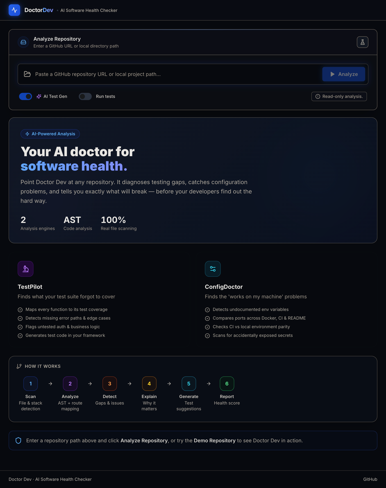](submission/screenshots/01-landing-and-repository-input.png)

</details>

<details>
<summary><strong>📊 02 · Repository profile and health overview</strong></summary>
<br>

[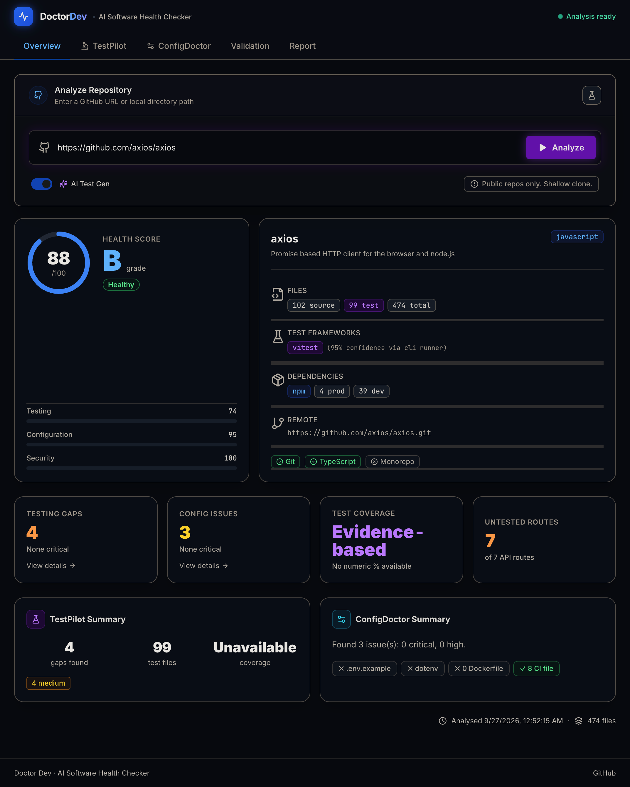](submission/screenshots/02-health-overview.png)

</details>

<details>
<summary><strong>🧪 03 · TestPilot evidence and testing gaps</strong></summary>
<br>

[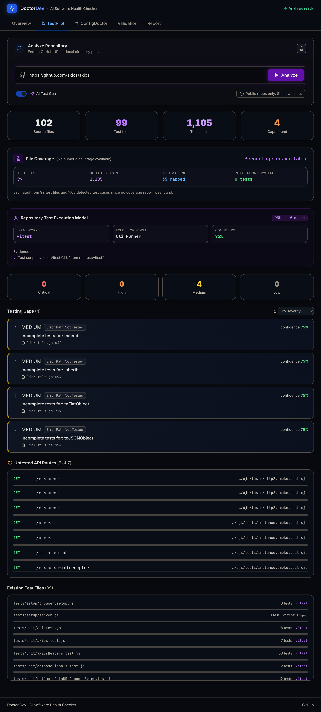](submission/screenshots/03-testpilot-evidence.png)

</details>

<details>
<summary><strong>⚙️ 04 · ConfigDoctor findings</strong></summary>
<br>

[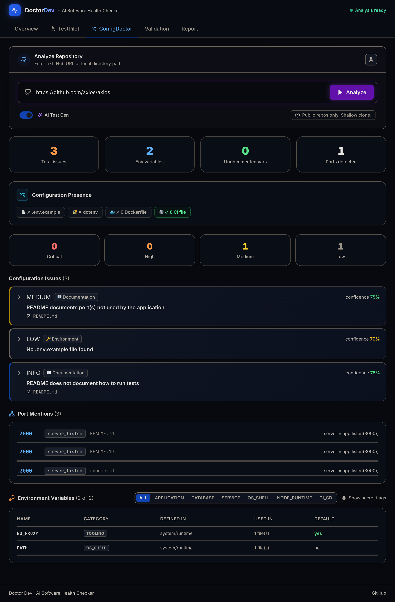](submission/screenshots/04-configdoctor-findings.png)

</details>

<details>
<summary><strong>📋 05 · Final health report and export actions</strong></summary>
<br>

[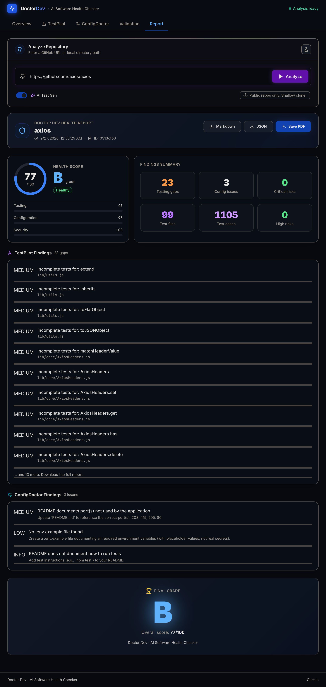](submission/screenshots/05-final-health-report.png)

</details>

---

## ✨ The idea in one minute

Modern repositories rarely fail because of one obvious syntax error. They fail in the gaps between systems:

- a critical function exists, but no test proves its behavior;
- code reads `JWT_SECRET`, but onboarding docs never mention it;
- Docker exposes one port while the application binds to another;
- CI uses a runtime version that conflicts with `package.json`;
- a public API route has happy-path tests but no authorization test;
- the README documents a command that no longer exists.

Each individual file can look correct while the repository as a whole is inconsistent.

**Doctor Dev connects those signals.** Point it at a local directory or public GitHub repository and it runs a multi-stage analysis pipeline that produces:

1. a repository technology profile;
2. evidence-based test health analysis;
3. configuration and runtime consistency checks;
4. prioritized findings with severity and confidence;
5. a transparent health score and grade;
6. optional test skeletons for high-impact gaps;
7. downloadable Markdown and JSON reports.

---

## 🎯 The problem

Developers lose time to repository-wide inconsistencies that ordinary tools inspect in isolation. Linters validate syntax. Test runners execute the tests that already exist. CI runs whatever it was configured to run. Documentation remains disconnected from code.

| Question | Why existing tools miss it |
|---|---|
| Which important behaviors have no meaningful test evidence? | A passing suite says nothing about code that was never exercised. |
| Are environment variables used in code actually documented? | Code, templates, Docker, and docs are usually checked separately. |
| Do runtime, Docker, CI, and documentation agree? | Each source can be valid by itself and contradictory as a system. |
| What should the team fix first? | Raw warnings do not explain impact, confidence, or priority. |
| Can a new contributor run the project successfully? | Onboarding failures emerge only after someone follows stale instructions. |

Doctor Dev treats the **repository as a connected system**, not a bag of unrelated files.

---

## 💡 The solution

Doctor Dev combines two focused diagnostic engines:

<table>
<tr>
<td width="50%" valign="top">

### 🧪 TestPilot

Finds important application behavior that lacks sufficient test evidence.

- Maps test files to production files
- Extracts symbols and API routes
- Ranks code by importance
- Detects missing happy, error, edge, and auth paths
- Separates production code from fixtures and examples
- Labels heuristic results honestly
- Generates starter tests for critical gaps

</td>
<td width="50%" valign="top">

### ⚙️ ConfigDoctor

Finds drift across code, configuration, containers, CI, runtime, and documentation.

- Compares environment variable usage and templates
- Checks Docker build and runtime practices
- Detects inconsistent port declarations
- Reviews CI install, test, and Node-version setup
- Verifies README setup guidance
- Flags secrets by name without exposing values
- Recommends a specific remediation

</td>
</tr>
</table>

Together they answer the practical question: **What is most likely to break, why does Doctor Dev believe that, and what should the developer do next?**

---

## 🚀 What Doctor Dev finds

### Repository understanding

- Detects language, ecosystem, framework, package manager, test runner, entry points, and monorepo structure.
- Recognizes npm, yarn, pnpm, Bun, pip, Poetry, Maven, Gradle, Cargo, Go modules, Bundler, and Composer metadata.
- Separates source, test, fixture, helper, benchmark, example, generated, and build files.
- Reads package scripts, dependency evidence, config files, Git metadata, and coverage artifacts.

### Evidence-based testing analysis

- JavaScript/TypeScript structural analysis with `ts-morph`.
- Python symbol, route, and test discovery through a language adapter.
- Importance scoring for exported functions, services, controllers, middleware, and route handlers.
- Test-to-source mapping using names, imports, and path proximity.
- Route coverage checks for common HTTP routing patterns.
- Gap categories covering absent, partial, error, edge, and authorization tests.
- Confidence scores and human-readable evidence for every meaningful finding.

### Honest coverage states

Doctor Dev avoids presenting a made-up percentage when numeric coverage is unavailable:

| State | Meaning |
|---|---|
| **Actual Coverage** | Parsed from a supported artifact such as LCOV or `coverage-summary.json`. |
| **Evidence Based** | Inferred from imports, naming, paths, and detected test cases. Explicitly labeled heuristic. |
| **Unavailable** | There is not enough trustworthy evidence to claim coverage. |

### Configuration diagnosis

- Compares code-level environment variable usage with templates.
- Filters common tooling and runtime variables to reduce false positives.
- Never reports raw secret values.
- Reviews Dockerfiles for deterministic installs, exposed ports, and non-root execution.
- Compares Docker Compose variables and ports with application expectations.
- Reviews CI configuration for runtime, installation, and test steps.
- Finds README omissions, stale commands, and documented port conflicts.
- Checks Node engine requirements and test script availability.

### Prioritization and reporting

- Produces testing, configuration, security, and overall scores.
- Assigns grades from **A** to **F** and health states of healthy, needs attention, or critical.
- Groups related issues into a focused priority list.
- Provides evidence, reasoning, recommended action, and estimated impact.
- Exports the result as Markdown or structured JSON.

---

## 🎤 Hackathon presentation

The eight-slide presentation covers the developer-workflow problem, Doctor Dev's two analysis engines, the evidence-based pipeline, product experience, business value, IBM Bob usage, and the roadmap.

<div align="center">

### [⬇️ Download the Doctor Dev presentation deck](submission/Doctor_Dev_Hackathon_Presentation_Deck.pptx)

**Microsoft PowerPoint · 8 slides · Includes presenter notes**<br>
[View the final PDF](submission/Doctor_Dev_Hackathon_Deck_Final.pdf)

</div>

---

## 🎬 Demo scenario

The included [`demo-repository/`](demo-repository/) is a deliberately imperfect TypeScript rideshare API. It makes Doctor Dev's value visible in a short demonstration without hardcoding analysis results.

### Deliberate test risks

- Ride cancellation lacks important state-transition and authorization cases.
- Fare calculation lacks zero, negative-distance, and boundary tests.
- Peak-hour logic lacks weekend and off-peak coverage.
- Payment handling lacks idempotency and failure-path coverage.
- Ride-history access lacks a meaningful authorization test.

### Deliberate configuration risks

- Docker and application ports disagree.
- Docker Compose omits a required secret variable.
- CI uses a Node version that conflicts with the engine requirement.
- CI does not execute the test suite.
- README runtime instructions contain stale port and command information.

> [!IMPORTANT]
> These results are not injected into the product. Doctor Dev discovers them through the same pipeline used for every repository.

### Suggested three-minute demo

1. Select **Try Demo**.
2. Show the live analysis stages.
3. Reveal the health score and highest-priority finding.
4. Expand one TestPilot card and explain its evidence.
5. Expand one ConfigDoctor card and show the cross-file inconsistency.
6. Open Validation to show a generated test skeleton.
7. Download the Markdown report.

---

## ⚡ Quick start

### Prerequisites

- Node.js 18 or newer
- npm 9 or newer
- Git for public GitHub repository analysis

### 1. Clone

```bash
git clone https://github.com/priyanshusharan-cmd/doctor-dev.git
cd doctor-dev
```

### 2. Install

```bash
npm run install:all
```

Equivalent manual installation:

```bash
npm install
npm install --prefix backend
npm install --prefix frontend
```

### 3. Configure

```bash
cp backend/.env.example backend/.env
```

```dotenv
PORT=3001
FRONTEND_URL=http://localhost:5173
```

To analyze local repositories outside the Doctor Dev directory or system temporary directory, configure explicit allowed roots:

```dotenv
DOCTOR_DEV_ALLOWED_ROOTS=/path/to/projects,/another/approved/root
```

### 4. Run

```bash
npm run dev
```

| Service | URL |
|---|---|
| Frontend | `http://localhost:5173` |
| Backend | `http://localhost:3001` |
| Health endpoint | `http://localhost:3001/api/health` |

### 5. Analyze

- Paste a public GitHub URL.
- Enter an allowed local repository path.
- Or choose **Try Demo**.

---

## 🧭 User workflow

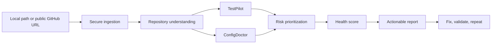

1. **Choose a repository.** Use an approved local path, full GitHub URL, or `owner/repository` shorthand.
2. **Choose options.** Generate test suggestions and optionally run a detected safe local test script.
3. **Watch the pipeline.** The UI reports each asynchronous stage.
4. **Inspect evidence.** Expand findings to understand why they exist.
5. **Prioritize work.** Begin with high-impact, high-confidence risks.
6. **Export results.** Download Markdown or JSON for review or planning.

---

## 🏗️ Architecture

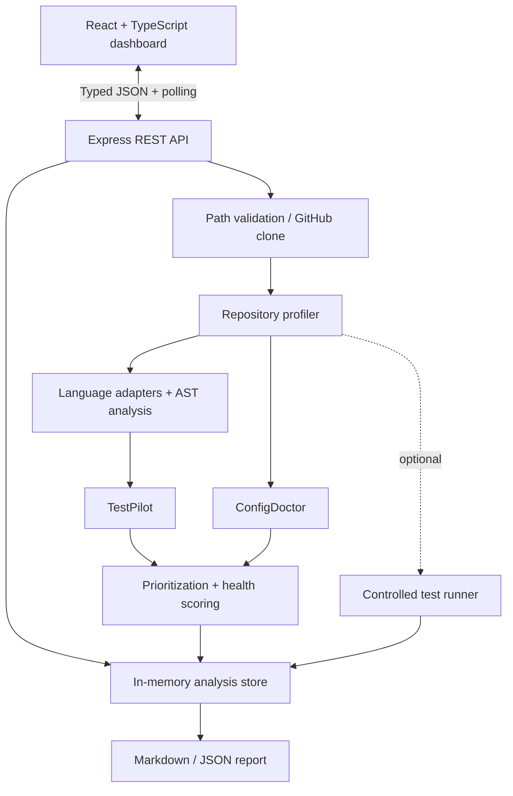

### Pipeline states

```text
pending
   └── scanning
         └── analyzing_code
               └── analyzing_tests
                     └── analyzing_config
                           └── prioritizing
                                 └── complete
```

| Stage | What happens |
|---|---|
| Secure ingestion | Validates an allowed local path or shallow-clones a public repository without a shell. |
| Repository scan | Finds and classifies source, test, configuration, fixture, example, and benchmark files. |
| Code analysis | Extracts symbols, routes, importance signals, and source classifications. |
| Test analysis | Detects runners, counts tests, maps evidence, and reads supported coverage artifacts. |
| Config analysis | Cross-checks variables, ports, containers, CI, docs, and runtime metadata. |
| Prioritization | Converts gaps and issues into ranked findings and component scores. |
| Reporting | Stores structured results for the dashboard and exports. |

### Backend boundaries

```text
backend/src/
├── routes/          Express route definitions
├── controllers/     Validation and HTTP orchestration
├── services/        Pipeline, GitHub ingestion, prioritization
├── analyzers/
│   ├── languages/   JavaScript/TypeScript and Python adapters
│   ├── repositoryAnalyzer.ts
│   ├── codeAnalyzer.ts
│   ├── testPilot.ts
│   └── configDoctor.ts
├── runners/         Controlled test execution
├── models/          In-memory analysis store
├── types/           Shared domain model
└── utils/           Security and filesystem helpers
```

### Frontend boundaries

```text
frontend/src/
├── api/             Typed REST client
├── components/      Cards, navigation, progress, and inputs
├── pages/           Overview, Testing, Configuration, Validation, Report
├── lib/             Pure presentation helpers
└── types/           Frontend result types
```

---

## 🧰 Technology stack

| Area | Technology | Purpose |
|---|---|---|
| UI | React 18 + TypeScript | Strict component-based dashboard |
| Tooling | Vite 5 | Fast development and optimized builds |
| Styling | Tailwind CSS | Responsive utility-first design |
| Icons | Lucide React | Consistent visual language |
| Charts | Recharts | Health and coverage visualization |
| API | Express + TypeScript | Typed analysis endpoints |
| Validation | Zod | Runtime request validation |
| AST | ts-morph | Structural JavaScript/TypeScript analysis |
| Discovery | fast-glob | Repository file classification |
| Processes | execa | Argument-based Git and controlled test execution |
| Development | IBM Bob 2.0 | Architecture, implementation, review, debugging |

---

## 🔐 Security model

Doctor Dev analyzes repositories that may not be trustworthy, so safety is a product constraint.

### Secret handling

- Variable **names** may be reported; their values are never returned.
- Sensitive names such as `API_KEY`, `SECRET`, `TOKEN`, `PASSWORD`, `PRIVATE_KEY`, `CREDENTIAL`, `AUTH`, and `ACCESS_KEY` are flagged case-insensitively.
- Reports, logs, and UI output avoid secret-value exposure.

### Filesystem safety

- Paths are normalized, resolved through real paths, and checked against approved roots.
- Null bytes, missing paths, non-directories, traversal, and symlink escapes are rejected.
- Analysis is read-only.
- Individual file reads are capped to avoid loading unexpectedly large content.

### Process safety

- Public repositories are cloned with argument-based execution, not shell interpolation.
- Clones are shallow, time-limited, isolated in managed temporary directories, and removed afterward.
- Test execution is opt-in and local-only.
- Only recognized direct test-runner commands are accepted.
- Shell operators, substitution, redirection, compound commands, arbitrary npm scripts, and unapproved `npx` packages are rejected.

> [!WARNING]
> Running a repository's tests still executes that repository's test code. Enable **Run tests** only for local repositories you trust. Static analysis remains read-only.

---

## 🔌 API reference

| Method | Endpoint | Description |
|---|---|---|
| `GET` | `/api/health` | Backend health and version information |
| `POST` | `/api/analyze` | Start an asynchronous repository analysis |
| `GET` | `/api/analysis/:analysisId` | Read progress, error, or completed results |
| `GET` | `/api/analyses` | List analyses in the current server process |

### Start an analysis

```bash
curl --request POST http://localhost:3001/api/analyze \
  --header 'Content-Type: application/json' \
  --data '{
    "repositoryPath": "./demo-repository",
    "runTests": false,
    "generateTests": true
  }'
```

Response:

```json
{
  "analysisId": "8ad32bb4-1fd5-4dc9-bfde-000000000000",
  "status": "pending"
}
```

### Poll an analysis

```bash
curl http://localhost:3001/api/analysis/8ad32bb4-1fd5-4dc9-bfde-000000000000
```

```json
{
  "id": "8ad32bb4-1fd5-4dc9-bfde-000000000000",
  "status": "analyzing_tests",
  "statusLabel": "Mapping test coverage",
  "repositoryPath": "/approved/path/to/repository",
  "createdAt": "2026-09-27T00:00:00.000Z"
}
```

Completed responses include the profile, symbols, routes, tests, mappings, gaps, generated tests, configuration health, priority findings, score, optional run result, and scan timestamp.

---

## ⌨️ Commands

| Command | Purpose |
|---|---|
| `npm run dev` | Start backend and frontend together |
| `npm run build` | Compile the backend and build the frontend |
| `npm run typecheck` | Run strict TypeScript checks |
| `npm test` | Run backend regression benchmarks |
| `npm run lint` | Run configured package lint checks |
| `npm run install:all` | Install all workspace dependencies |

---

## 🧪 Quality and validation

The regression suite covers ecosystem classification, variable semantics, port filtering, Python discovery, score calibration, coverage-state handling, framework propagation, package manager detection, tooling-variable filtering, non-production route filtering, large-repository false-positive prevention, traversal protection, allowed path handling, and test-command injection protection.

Before submitting a change:

```bash
npm test
npm run typecheck
npm run build
```

Engineering principles:

- strict TypeScript with no production `any`;
- structured JSON instead of opaque prose;
- evidence attached to non-trivial findings;
- no hardcoded demo results;
- read-only analysis;
- honest confidence and heuristic labels;
- a runnable application at every phase gate.

---

## 🤖 Built with IBM Bob 2.0

Doctor Dev was developed with **IBM Bob 2.0 as a senior pair-programming partner**, directly supporting the developer workflow that the product improves.

IBM Bob contributed to:

- the TestPilot and ConfigDoctor architecture;
- backend boundaries and the shared type model;
- repository discovery and AST analysis;
- evidence-based test mapping and health scoring;
- mature-repository false-positive debugging;
- the React dashboard and complete UI states;
- path, secret, Git, and test-execution security;
- the demo scenario and technical documentation;
- strict TypeScript and regression review.

The detailed development narrative is in [`docs/bob-usage.md`](docs/bob-usage.md). The submission includes the [complete IBM Bob screenshot set](submission/bob-usage/) and the [exported Bob task JSON](submission/bob-task-fcbb69e7abf2f34a815ca5d7aa172b92-2026-09-26.json). These are real session artifacts; the project explicitly prohibits fabricated evidence.

### Why IBM Bob mattered

The challenge asks builders to improve a developer workflow with repository-aware AI. Bob's repository context made it possible to reason across frontend state, backend types, analyzers, security, tests, and documentation as one system. That connected-repository philosophy became the foundation of Doctor Dev.

### IBM Bob usage evidence

These screenshots preserve the actual Bob task sequence: project planning, repository and architecture review, analyzer debugging, targeted fixes, and end-to-end validation.

<details>
<summary><strong>🤖 Open the IBM Bob screenshot gallery (12 captures)</strong></summary>
<br>

<table>
<tr>
<td width="33%" align="center"><a href="submission/bob-usage/bob-session-01.png">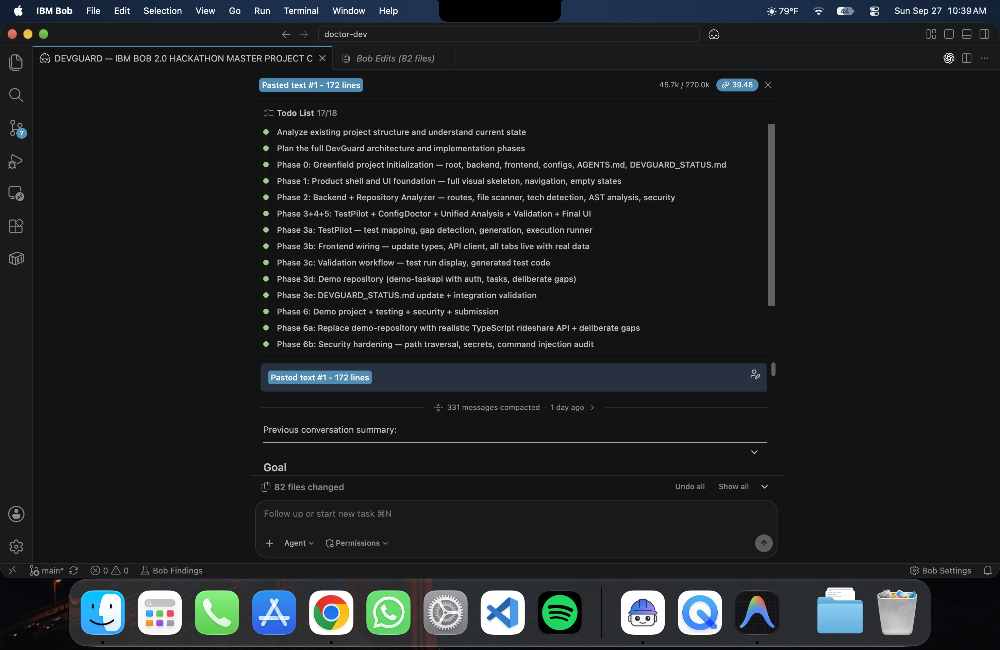</a><br><strong>01 · Project plan and phases</strong></td>
<td width="33%" align="center"><a href="submission/bob-usage/bob-session-02.png">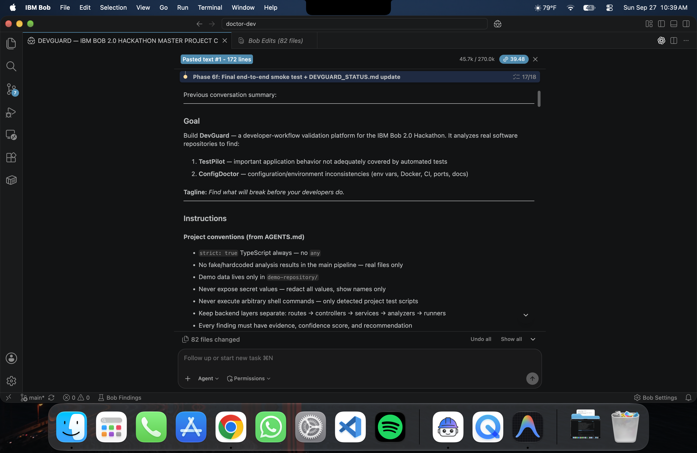</a><br><strong>02 · Goals and engineering rules</strong></td>
<td width="33%" align="center"><a href="submission/bob-usage/bob-session-03.png"></a><br><strong>03 · Stack and workflow review</strong></td>
</tr>
<tr>
<td width="33%" align="center"><a href="submission/bob-usage/bob-session-04.png">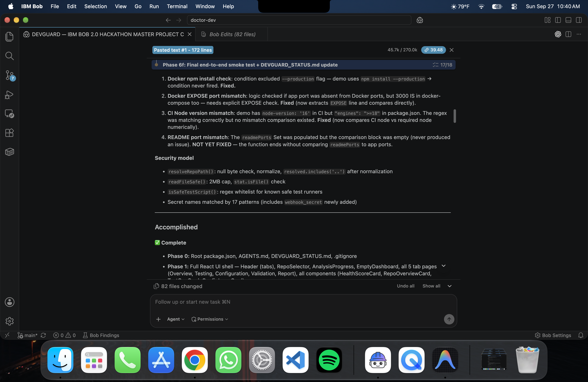</a><br><strong>04 · ConfigDoctor root causes</strong></td>
<td width="33%" align="center"><a href="submission/bob-usage/bob-session-05.png"></a><br><strong>05 · Completed phases</strong></td>
<td width="33%" align="center"><a href="submission/bob-usage/bob-session-06.png">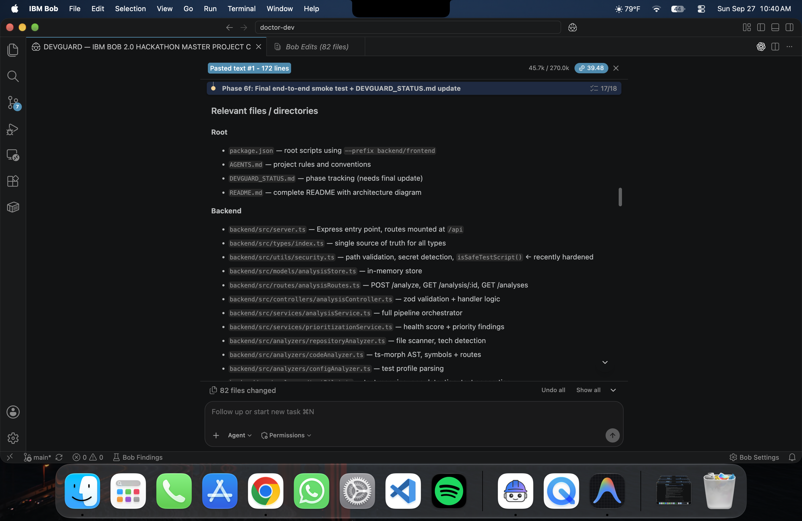</a><br><strong>06 · Backend repository map</strong></td>
</tr>
<tr>
<td width="33%" align="center"><a href="submission/bob-usage/bob-session-07.png">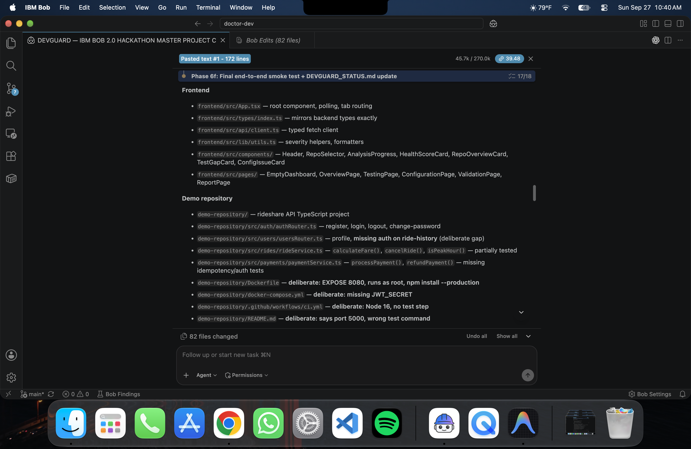</a><br><strong>07 · Frontend and demo review</strong></td>
<td width="33%" align="center"><a href="submission/bob-usage/bob-session-08.png">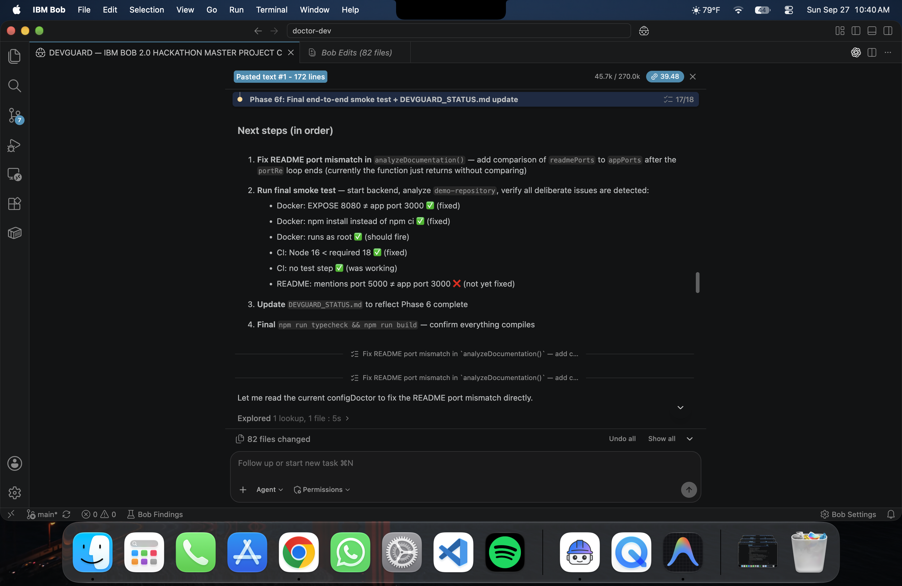</a><br><strong>08 · Final smoke-test plan</strong></td>
<td width="33%" align="center"><a href="submission/bob-usage/bob-session-09.png">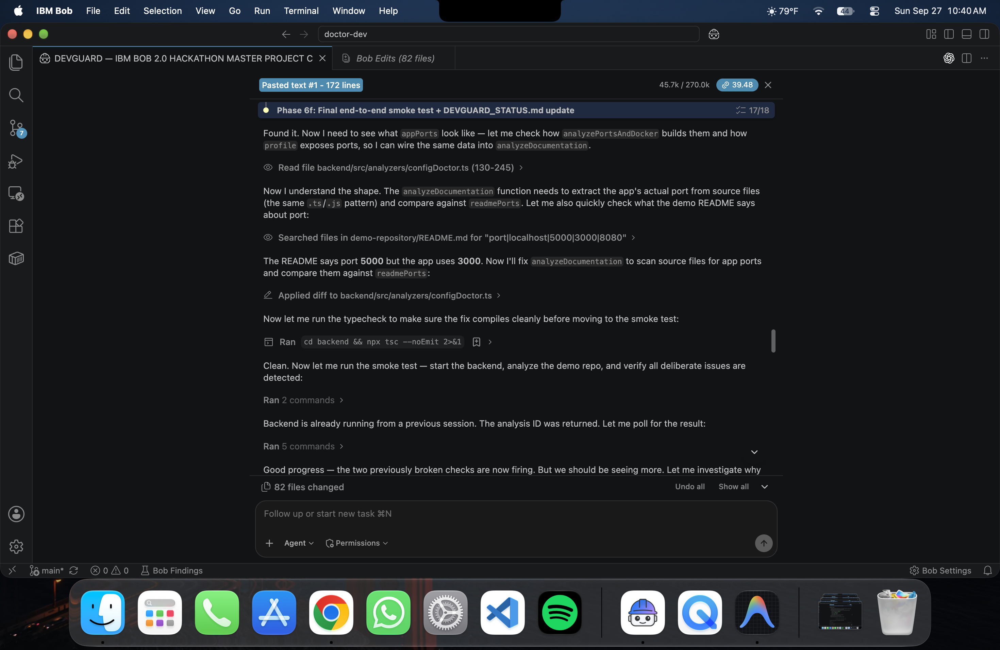</a><br><strong>09 · Port fix and typecheck</strong></td>
</tr>
<tr>
<td width="33%" align="center"><a href="submission/bob-usage/bob-session-10.png">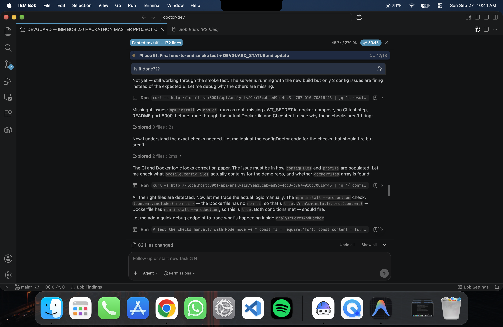</a><br><strong>10 · Smoke-test debugging</strong></td>
<td width="33%" align="center"><a href="submission/bob-usage/bob-session-11.png">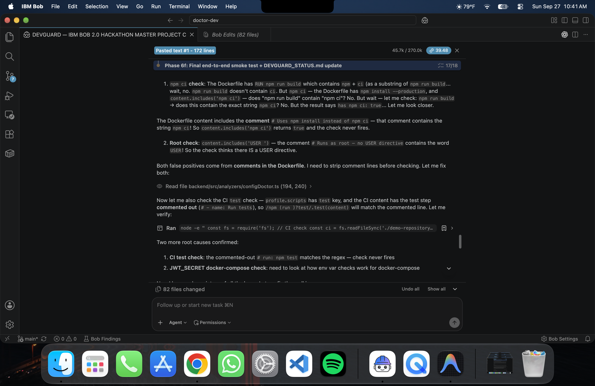</a><br><strong>11 · False-positive diagnosis</strong></td>
<td width="33%" align="center"><a href="submission/bob-usage/bob-session-12.png"></a><br><strong>12 · Targeted analyzer fixes</strong></td>
</tr>
</table>

</details>

Direct evidence: [all Bob screenshots](submission/bob-usage/) · [Bob task JSON export](submission/bob-task-fcbb69e7abf2f34a815ca5d7aa172b92-2026-09-26.json)

---

## 🗂️ Project structure

```text
doctor-dev/
├── frontend/                 React dashboard
├── backend/                  Express analysis API
├── demo-repository/          Deliberately imperfect rideshare API
├── docs/
│   ├── architecture.md       Technical architecture
│   ├── benchmark.md          Benchmark notes
│   └── bob-usage.md          IBM Bob development record
├── bob_sessions/             Real IBM Bob evidence store
├── submission/               Hackathon screenshots, Bob evidence, deck, and demo video
├── AGENTS.md                 Engineering conventions
├── DOCTOR_DEV_STATUS.md      Phase tracking
└── README.md                 Project overview
```

---

## 🗺️ Roadmap

- [x] Repository profiling and technology detection
- [x] JavaScript/TypeScript structural analysis
- [x] Python language adapter
- [x] Evidence-based test mapping
- [x] ConfigDoctor cross-file checks
- [x] Health scoring and priority findings
- [x] Public GitHub repository ingestion
- [x] Controlled local test execution
- [x] Markdown and JSON export
- [ ] First-class Java, Go, Rust, C++, C#, PHP, and Ruby adapters
- [ ] Persistent analysis history
- [ ] GitHub App and pull-request annotations
- [ ] Organization policies and baselines
- [ ] SARIF export and CI quality gates

---

## ⚠️ Current limitations

- Deep analysis is strongest for JavaScript/TypeScript, with an initial Python adapter. Other ecosystems may be profiled without equivalent symbol-level analysis.
- Evidence-based coverage is heuristic unless a supported coverage artifact exists.
- Dynamic imports, generated routes, metaprogramming, and custom harnesses can reduce confidence.
- Analysis history is in memory and resets with the backend.
- Public GitHub repositories are supported; private authentication is not implemented.
- Local paths must be inside configured analysis roots.
- Generated tests are starter skeletons and require developer review.

These constraints are visible because trustworthy tooling should distinguish evidence from inference.

---

## 🤝 Contributing

Contributions are welcome. Keep changes aligned with [`AGENTS.md`](AGENTS.md):

1. Keep TypeScript strict and avoid `any`.
2. Add a regression test for analyzer behavior.
3. Preserve read-only repository analysis.
4. Never expose secret values.
5. Keep routes thin and logic in services or analyzers.
6. Run all verification commands before opening a pull request.

```bash
git checkout -b feature/your-improvement
npm test
npm run typecheck
npm run build
```

---

<div align="center">

<strong>🩺 Doctor Dev</strong>

**Find what will break before your developers do.**

Built with care, repository evidence, strict TypeScript, and IBM Bob 2.0.

Made by **Priyanshu Sharan**

<a href="https://www.linkedin.com/in/priyanshusharan/"></a>

[Back to top](#top)

</div>
